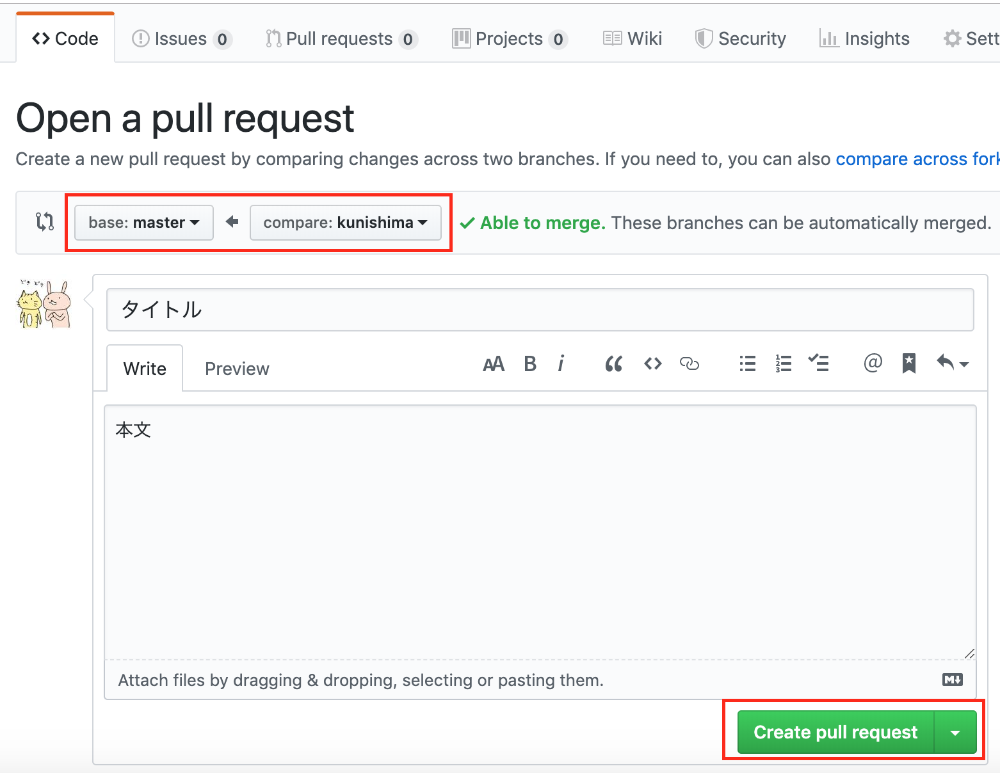

# GitHub講座


## *Lesson0 Gitをinstallする*  

**Windows**  
`git bash`を使っていくと便利です。  
[【初心者向け】Gitのインストール方法](https://eng-entrance.com/git-install)  


**Mac**  
ターミナルを起動し
```
$ brew install git
```
をコマンドすればインストールされます。


**インストールの確認**  
それぞれの環境で
```
$ git --version
```
をコマンド
`git version 0.00.0`
というようにバージョンが表示される。   


### **GitHubのアカウント作成**  
[GitHub](https://github.com/login)   にアクセス  
`New to GitHub? Create an account.` をクリック   
必要項目を入力して完成。   

---


## *Lesson1 GitHubからRepositoriesをClone*  

**講座用のRepositoriesをCloneしよう**  
[講座のテキストページ](https://github.com/kuniatsu/workShopGitHub) からURLを調べる
```
$ git clone `URL`
```


---


## *Lesson2 branchの状態確認方法*  
変更のない状態のメッセージを見ておきましょう。  

**差分がないことを確認しよう**   
```
$ git diff
```
何も表示されない  

**branchに差分のあるファイルがないことを確認しよう**  
```
$ git status

On branch master
Your branch is up-to-date with 'origin/master'.
nothing to commit, working tree clean
```

**branchのlogを確認してみよう**  
```
$ git log
```
これまでのlogを表示。  
ENTERキーでスクロール  
qキーを押して終了  

**repositoryのbrnachを確認してみよう**  
```
$ git branch
```
今作られているbranchを確認  
masterだけ表示される


```
repository
└── branch
    └── file
        └── diff(差分)
```
各階層毎にgitを使った管理を行なっていきます。


---


## *Lesson3 diff(差分)を確認する*  

**master.mdを変更して差分を確認する**  
git管理されているmaster.mdに編集をして差分を見てみましょう。  
```
$ git diff
```
先頭に-が付いている行は変更前   
先頭に+が付いている行は変更後   
になります。


**ファイルを追加して差分を確認する**  
差分のあるファイルを見てみましょう。   
```
$ git status
```
変化のあったファイルが表示される   


```
repository
└── branch
    └── file           ←どのファイルに変更があったのか？
        └── diff(差分)　←どの行に変更があったのか？
```


---


## *Lesson4 ファイルを確認する*  

**ファイルを追加して差分を確認する**  
git管理されているフォルダにファイルを追加して差分を見てみましょう。 
textファイルやフォルダを適当に作ってみてください。    
```
$ git status
```
新しく追加したファイルも確認できる。


```
repository
└── branch
    └── 新ファイル (file)  ←どのファイルに変更があったのか？
    └── master.md(file)  ←どのファイルに変更があったのか？
        └── diff(差分)　
```


---
## *Lesson5 branchに変更を確定させる*  

**確定するファイルを選択しよう**  
```
$ git status
$ git add `ファイル名`
$ git status
```
git statusで出てくるファイル名をaddで選択すれば、   
変更を確定する対象のファイルになります。　　  
これを　`「indexする」` と言います。　　
addした後に、git statusをすると、  
文字が緑色になっています。  
これはindexされたということです。   


**新しいファイルを反映しよう**  
```
$ git commit　-m "変更内容のコメント"
$ git status
```
変更内容のコメントの部分には、  
どんな変更をしたかわかるコメントを書いてください。    
このコメントがgit logで表示されるコメントになります。   
変更が確定するとstatusでは表示されなくなります。   


**commitの履歴を確認しよう**  
```
$ git log
```
反映が終わったら、   
logを確認します。   
先ほど書いたコメントが確認できれば成功です。   


```
repository
└── branch             ←今使用しているbranchに変更がされる。
    └── file           ←選択したファイルの変更が確定される。
        └── diff(差分)　
```


---
## *Lesson6 変更を元に戻す*  


**rollbackしよう**  
```
$ git log
* IDを調べる
$ git reset --hard `commitのID`
$ git log
```
branchを元に戻します。    
自分が変更を加える前の状態に戻してみましょう。  
logにある`commit c87e9e246dff692d2b53585a6c548067e8d37f89`  
の 「c87e9e246dff692d2b53585a6c548067e8d37f89」の部分がIDです。  
branchを変更前に戻したら、  
ファイルが戻っているか確認しましょう。   

```
repository
└── branch             
    └── file(変更前) ← file(変更後)  ※以前のcommitした状態に戻ります。
```


---


## *Lesson8 GitHubの設定する*  

**ユーザ名・アドレス・URLを確認する**  
```
$ git config user.name
$ git config user.email
$ git remote -v
```

**ユーザ名・アドレス・URLを登録する**  
```
$ git config user.name `GitHubのユーザ名`
$ git config user.email `GitHubのアドレス`
$ git remote add origin `https://ユーザ名@github.com/kuniatsu/workShopoGitHub.git`
```

---


## *Lesson9　新しいbranchを作る*  

GitHubの画面から新branchを作成する


**Localのbranchを確認しよう**  
```
$ git branch
$ git branch -a
```
-a の時に赤文字で表示されるbranchは、  
リモートリポジトリにはあるけど、  
ローカルリポジトリにはないbranchです。 


**branchの情報を更新しよう**  
```
$ git fetch
$ git branch
$ git branch -a
```
git fetchでリポジトリの情報をリモートリポジトリと同期することができる。   

```
リモートrepository
└── master(branch)             
└── `名前`(branch)    ←新しくbranchを作成 
└── .
└── ..
└── ...
...
　        

```

---
## *Lesson10 branchを切り替える*  


**branchを変更しよう**  
```
$ git checkout `branch名`
$ git branch
```

リモートリポジトリのbranchをcheckoutすることで、  
ローカルリポジトリに持ってくることができます。   
現在使用しているbranchは git branchをした際に*が付いているブランチになります。   


```
ローカルrepository
└── master(branch)             
└── `名前`(branch)    ←こちらのブランチに変更         

```


---


## *Lesson11　remoteのRepositoriesに変更を反映させる*  

**Repositoriesに新しい変更を反映をしよう**  

ファイルになんらかの変更を加えておく。   
```
$ git add `変更したファイル`
$ git commit -m "変更内容のメモ"
$ git push
```
pushが完了したらGithub上も変更しているか確認してみよう。


---

## *Lesson12 branchごとにファイルを管理*  

**master_branchに切り替える**  

```
$ git checkout master
```
名前branchの変更やlogがなくなっている事を確認   

```
ローカルrepository
└── master(branch)   ←変更が入っていない。          
└── `名前`(branch)    ←先ほどの変更が入っている           
```

---
## *Lesson13 Localのファイルの衝突*  

**同じ変更を作って衝突させる** 

```
＊ Lesson11で名前branchに下変更と同じ場所に変更を加える
$ git checkout 自分のbranch
```
加えた変更が消えてしまうためgitが変更を守る。  


**強制的にチェックアウトする** 

```
$ git checkout -f `名前branch` 
```
fはforceの略で強制的にcheckoutさせるという事  
強制的にbranchを変えるので、確定させていない変更はなくなってしまう。
上書きがされる。   

---

## *Lesson14 リモートでリジェクト＆コンフリクトを起こす*  

**同じファイルを編集して衝突させる** 
```
$ git checkout 名前branch
```
くにしまが変更を行うので確認する  

同じ箇所に別の修正を入れて衝突させる
```
$ git add `ファイル名`
$ git commit -m "なんらかコメント"
$ git push
```
push拒否される　`リジェクト` 


```
$ git pull
$ git status
```
↑`コンフリクト` が発生するので解決する


```
$ git push
```
pushに成功する。


---

## *Lesson15 プルリクを送る*  


「New pull request」を押します。    


どのブランチをどのブランチにマージするかを選択   
「Create pull request」を押下で作成完了です。   

